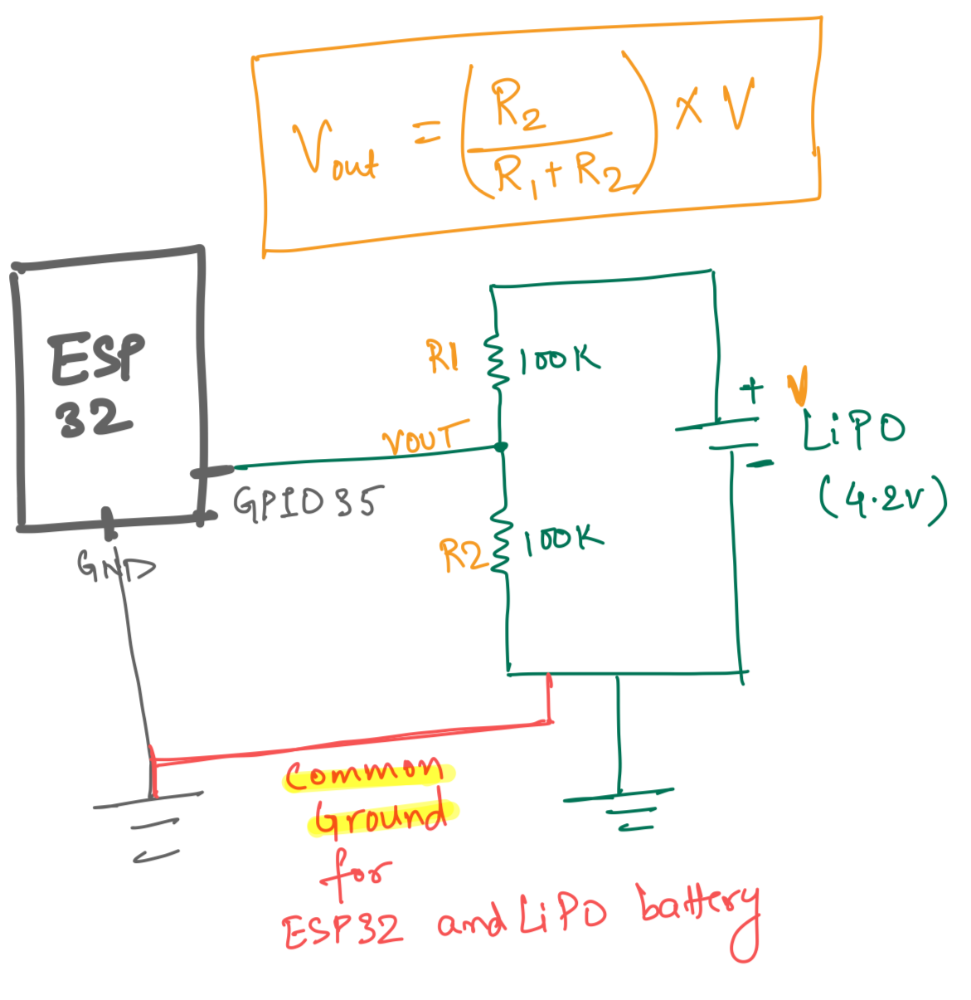

## Battery Monitor

Use Voltage Divider to monitor the voltage

- Use ADC1 GPIO32 - GPIO39 for measurement. 
- ADC2 is not reliable when using WiFi.
- To find the right GPIO, refer https://docs.espressif.com/projects/esp-idf/en/v4.4/esp32/api-reference/peripherals/adc.html
- **IMP**: GND of ESP32 and Battery should be common
- For more ADC example, refer [https://github.com/piyush-saurabh/esp32-practice/blob/main/gpio/main/main.c]

## MOSFET as switch
- P-Channel MOSFET is used to connect and disconnect the battery from [TP4056](https://robu.in/product/tp4056-1a-li-ion-lithium-battery-charging-module-micro-b-usb/) LiPo charger.
- P-channel MOSFET used: [IRF9540N](https://robu.in/product/irf540n-to-220-3-mosfet-pack-of-2-ics/)

ESP32 GPIO|MOSFET State|Description|
----------|------------|----------|
0 (0V)     | Source and Drain connected | Battery connected to TP4056 / Battery Charging |
1 (3.3V)    | Source and Drain disconnected | Battery disconnected from TP4056 / Battery Not Charging

- 1k register is added between GPIO and MOSFET Gate to prevent the damage to ESP32 GPIO pin
- 10k pull-down register is added to Gate to 

