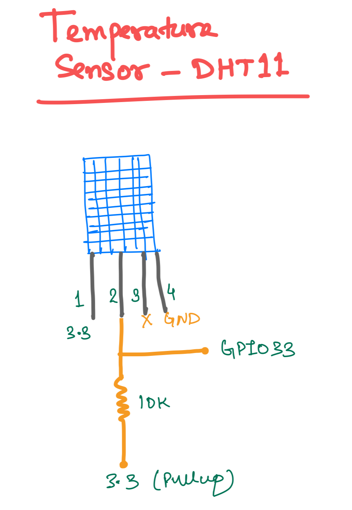

## Description
This folder contains the code for testing the custom ESP32 board. Below is the mapping of pin with the functionality

| GPIO | Functionality |
|------| --------------|
|  02    | Reset Button |
|  04    | Red LED |
|  25    | Green LED |
|  27    | External Load |
|  33    | Temperature Sensor (DHT11) | 
|  34    | Light Sensor (LDR) | 

Below is the mapping 

### Temperature Sensor
Sensor used: DHT11

Ref
- https://esp-idf-lib.readthedocs.io/en/latest/groups/dht.html
- https://github.com/UncleRus/esp-idf-lib/tree/master/components/dht